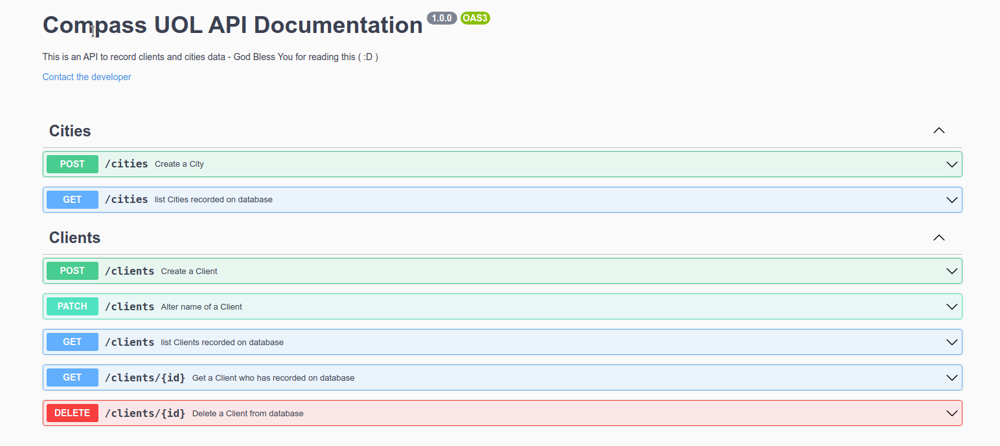

# Compass UOL!

### by Fernando Stteffen | fernando.stteffen@gmail.com

## Tecnologias usadas

- NodeJs v16.13.0
- Git
- Express
- Tsynger
- Typescript
- TypeORM
- Postgress
- Docker
- Padrão Rest
- Swagger

## Requisitos pre-instalação

- NodeJs previamente instalado
- Docker
- Docker-Compose

# Como instalar a API

## 1. Primerio devemos fazer o clone e entrar na pasta.

```
git clone git@github.com:fernando-stteffen/compass-test.git

cd compass-test
```

## 2. Fazer a instalação dos container docker

```
  dock-compose up
```

aguarde até tudo ser instalado.

## 4. executar as migrations para configuar o banco de dados

```
  yarn typeorm migrations:run
```

# Pronto já está rodando!!!

basta acessar a documentação em: http://localhost:3000/docs


<br/>

## Regras de negócio

1. Cadastrar cidade

- modules/cities/useCases/creatCity

---

2. Cadastrar cliente

- modules/clients/useCases/createClient

---

3. Consultar cidade pelo nome
4. Consultar cidade pelo estado

- modules/cities/useCases/listCities

---

5. Consultar cliente pelo nome

- modules/clients/useCases/listClients

---

6. Consultar cliente pelo Id

- modules/clients/useCases/getClientByID

---

7. Remover cliente

- modules/clients/useCases/deleteClient

---

8. Alterar o nome do cliente

- modules/clients/useCases/alterClientName

<br/>

<br/>

<br/>

# Fim obrigado!

se precisa basta entrar em contato com fernando.stteffen@gmail.com
